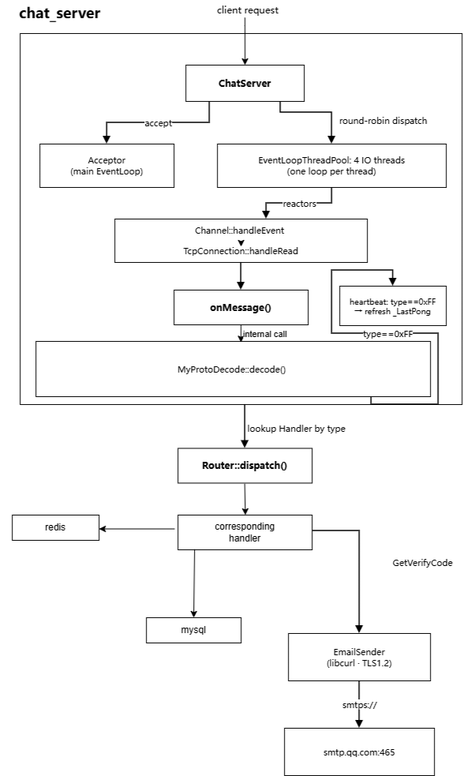

# chatroom

## 介绍

一个基于C++的多线程多人聊天室，服务端使用主从reactor架构

支持好友、群组、私聊/群聊、历史记录、文件断点续传、邮箱验证码注册/登录/找回密码等功能

数据库中数据的存储和取用使用序列化和反序列化完成 - 序列化 JSON

使用 Redis 存储  好友/群组/文件列表等 ， 使用Mysql存储聊天历史 / 离线信息等

## 环境

​	OS: Ubuntu 24.04 x86_64 

​	编译器: g++（C++17）

​	构建工具: CMake  3.10

​	依赖动态库: jsoncpp、hiredis、mysqlclient、curl、libcrypto

## 架构

服务器架构设计




客户端架构设计

.png)

## 编译及运行

```
使用服务端
mkdir -p server/build && cd server/build
cmake ..
make
./chat_server ip port        # 默认 0.0.0.0:2026

使用客户端（另开终端）
mkdir -p Client/build && cd Client/build
cmake ..
make
./chat_client ip port        # 默认 127.0.0.1:2026
```

## 目录结构

概览

```
.
├── BusinessLogic
├── Client
├── netlayer
├── protocal
└── server
```

具体目录

```markdown
BusinessLogic
├── AcceptFriendHandler.cc
├── AcceptFriendHandler.h
├── AddFriendHandler.cc
├── AddFriendHandler.h
├── AddGroupAdminHandler.cc
├── AddGroupAdminHandler.h
├── ApproveJoinHandler.cc
├── ApproveJoinHandler.h
├── BlockFriendHandler.cc
├── BlockFriendHandler.h
├── CreateGroupHandler.cc
├── CreateGroupHandler.h
├── DeleteAccountHandler.cc
├── DeleteAccountHandler.h
├── DeleteFriendHandler.cc
├── DeleteFriendHandler.h
├── DeleteGroupHandler.cc
├── DeleteGroupHandler.h
├── EmailSender.cc
├── EmailSender.h
├── FileTransferHandler.cc
├── FileTransferHandler.h
├── GetVerifyCodeHandler.cc
├── GetVerifyCodeHandler.h
├── GroupChatHandler.cc
├── GroupChatHandler.h
├── Hashtools.cc
├── Hashtools.h
├── JoinGroupHandler.cc
├── JoinGroupHandler.h
├── LeaveGroupHandler.cc
├── LeaveGroupHandler.h
├── LoginByCodeHandler.cc
├── LoginByCodeHandler.h
├── LoginHandler.cc
├── LoginHandler.h
├── LogoutHandler.cc
├── LogoutHandler.h
├── MessageType.h
├── MySqlClient.cc
├── MySqlClient.h
├── PrivateChatHandler.cc
├── PrivateChatHandler.h
├── QueryFriendHandler.cc
├── QueryFriendHandler.h
├── QueryGroupMembersHandler.cc
├── QueryGroupMembersHandler.h
├── QueryHistoryHandler.cc
├── QueryHistoryHandler.h
├── QueryUserGroupsHandler.cc
├── QueryUserGroupsHandler.h
├── redisClient.cc
├── redisClient.h
├── RegisterHandler.cc
├── RegisterHandler.h
├── RejectFriendHandler.cc
├── RejectFriendHandler.h
├── RemoveGroupAdminHandler.cc
├── RemoveGroupAdminHandler.h
├── RemoveGroupMembersHandler.cc
├── RemoveGroupMembersHandler.h
├── ResetPasswordHandler.cc
├── ResetPasswordHandler.h
├── UnBlockFriendHandler.cc
└── UnBlockFriendHandler.h
Client
├── base64.h
├── Client.cc
├── Client.h
├── CMakeLists.txt
└── main.cc
netlayer
└── muduo
    ├── base
    │   ├── Logging.h
    │   ├── noncopyable.h
    │   └── Timestamp.h
    └── net
        ├── Acceptor.cc
        ├── Acceptor.h
        ├── Buffer.cc
        ├── Buffer.h
        ├── Callbacks.h
        ├── Channel.cc
        ├── Channel.h
        ├── Connector.cc
        ├── Connector.h
        ├── EventLoop.cc
        ├── EventLoop.h
        ├── EventLoopThread.cc
        ├── EventLoopThread.h
        ├── EventLoopThreadPool.cc
        ├── EventLoopThreadPool.h
        ├── InetAddress.h
        ├── Poller.cc
        ├── Poller.h
        ├── Socket.h
        ├── SocketsOps.cc
        ├── SocketsOps.h
        ├── TcpClient.cc
        ├── TcpClient.h
        ├── TcpConnection.cc
        ├── TcpConnection.h
        ├── TcpServer.cc
        ├── TcpServer.h
        ├── Timer.h
        ├── TimerId.h
        ├── TimerQueue.cc
        └── TimerQueue.h
protocal
├── pack.cpp
├── pack.h
├── protocal.h
├── unpack.cpp
└── unpack.h
server
├── ChatServer.cc
├── ChatServer.h
├── CMakeLists.txt
├── main.cc
├── Router.cc
└── Router.h

8 directories, 119 files
```

