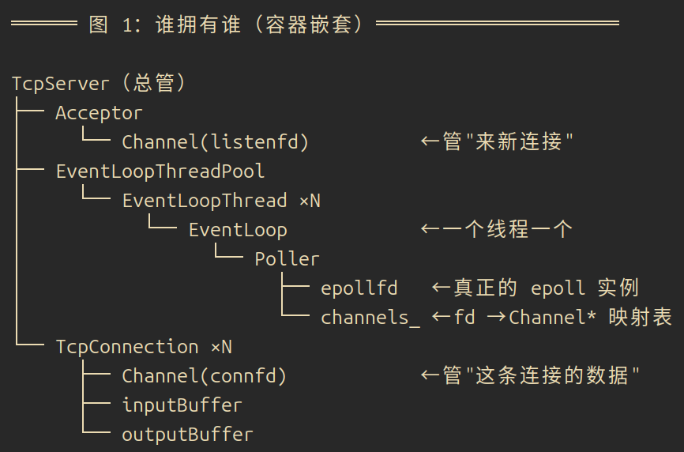
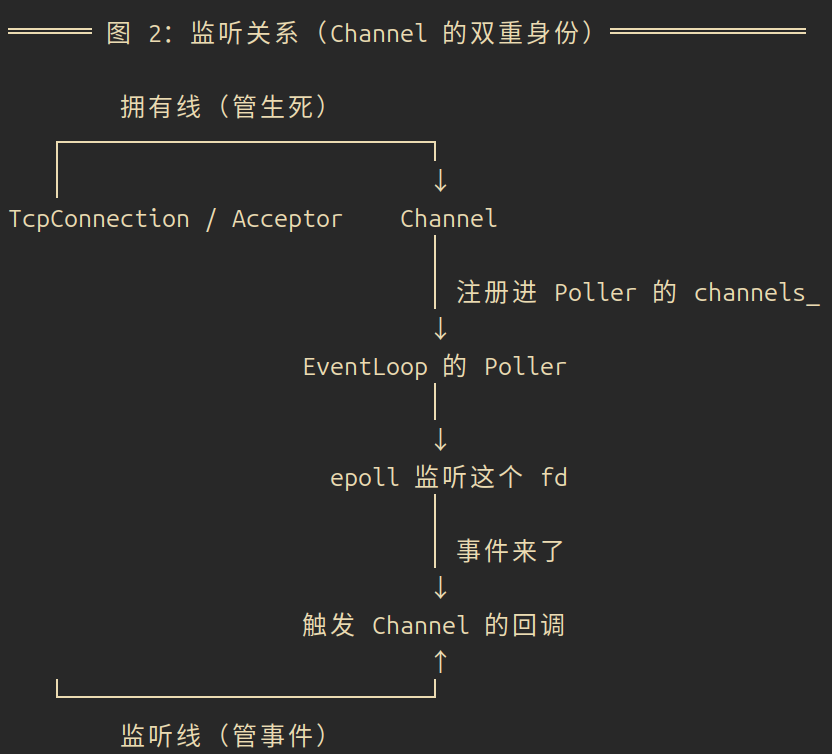

# 答辩Later

---

## OSI 的七层 和 TCP/IP 的四层or 五层

OSI 七层从下往上是"物数网传会表应"：物理层、数据链路层、网络层、传输层、会话层、表示层、应用层。

物理层传的是最原始的比特流（0101），管接口、电压、线缆这些物理细节，对应网线、光纤、集线器。数据链路层把比特组成帧，用 MAC 地址在同一网段内传输，对应交换机、以太网。网络层负责路由选择，用 IP 地址跨网段传输，对应路由器。传输层做端到端通信，用端口区分不同进程，TCP、UDP 都在这层。再往上会话层管会话的建立和终止，表示层管数据格式转换、加密、压缩，应用层直接服务应用，HTTP、DNS、FTP 都在这里。

TCP/IP 四层模型是把七层合并出来的，实际四层其实就是：应用层（会话+表示+应用三层合并）、传输层、网络层、网络接口层（数据链路层+物理层合并）。

五层模型也差不多，就是把"网络接口层"再拆回成物理层和数据链路层，其它的三层不变。

---

## TCP 可靠 vs UDP 不可靠

TCP有四个特点：面向连接（先三次握手再通信）、可靠（不丢不重不乱序-> PS:UDP撒手掌柜，数据发出去就不管了，很有可能会丢包）、全双工（双方能同时收发）、字节流（没有消息边界，这就是粘包的根源 , Buffer处理）。

跟 UDP 一对比就很清楚：TCP 面向连接，UDP 无连接直接发；TCP 可靠，靠确认加重传加排序，UDP 不可靠，可能丢、乱序、重复；TCP 是字节流没边界，UDP 是数据报每包独立有边界；TCP 慢因为握手确认拥塞控制都有开销，UDP 快。所以网页、文件、聊天、邮件用 TCP，直播、DNS、游戏、音视频用 UDP。

### 三次握手

第一步客户端发 SYN=1、seq=x，进入 SYN_SENT；第二步服务端回 SYN=1、ACK=1、seq=y、ack=x+1，进入 SYN_RCVD；第三步客户端再回 ACK=1、seq=x+1、ack=y+1，双方进入 ESTABLISHED。

目的是确认双方收发能力都正常，顺便交换初始序列号。

###### 为什么不是两次？

因为两次的话，服务端发完 SYN+ACK 就以为连接建立了，如果客户端第一个 SYN 因为网络延迟迟到，服务端会为一个早就失效的连接请求白白分配资源。三次握手让客户端有能力拒绝这种"旧报文"建立的连接。

###### 为什么不是四次？

因为第二步把服务端的 SYN 和 ACK 合并成一条发了（SYN+ACK），三次就够了。

### 四次挥手

第一步客户端发 FIN=1，进 FIN_WAIT_1；第二步服务端回 ACK=1，进 CLOSE_WAIT，客户端进 FIN_WAIT_2，这时候是半关闭，服务端可能还有数据没发完；第三步服务端发 FIN=1，进 LAST_ACK；第四步客户端回 ACK=1，进 TIME_WAIT，服务端关闭。

为什么挥手要四次？因为 TCP的双方能同时收发，两个方向得各自独立关闭。服务端收到 FIN 后可能还有数据要发，所以先回个 ACK，等发完了再发自己的FIN，ACK和 FIN 不能合并。

###### TIME_WAIT 为什么是 2MSL？

两个原因：一是保证最后一个 ACK 能被对方收到，丢了的话对方会重发 FIN，2MSL 够它重发一次再处理完；二是让这次连接的旧报文在网络里彻底消失，别干扰下一次用相同四元组建立的新连接。

### TCP 靠什么做到可靠

序列号加确认号，每个字节有序号，接收方能排序去重。累计确认，确认号 N 表示 N 之前的数据全收到了。超时重传，超过 RTO 没收到 ACK 就重发。快速重传，接收方收到乱序数据会重复发同一个 ACK，发送方连续收到 3 个重复 ACK 就立刻重传，不用等超时。流量控制靠滑动窗口，接收方通过 Window 字段告诉发送方自己还能收多少，防止发送方把慢接收方淹没。拥塞控制是防止把网络本身塞爆。

### 拥塞控制

流量控制是"对接收方负责"，拥塞控制是"对网络负责"，两个不一样。

拥塞控制有四个算法，分别是慢启动和拥塞避免和快重传还有快恢复。

慢启动：拥塞窗口 cwnd 从 1 开始，每收到一个 ACK 就指数级翻倍，1、2、4、8 这样快速探测网络容量。拥塞避免：cwnd 涨到慢启动阈值 ssthresh 之后，改成线性增长，每轮加 1，不再翻倍。快重传：收到 3 个重复 ACK，不等超时立刻重传丢的包。快恢复：快重传之后不把 cwnd 打回 1，而是降到 ssthresh 的一半左右再线性增长，避免性能骤降。

这里有个区分要记住：超时说明网络可能真堵了，cwnd 直接打回 1 重新慢启动；而 3 个重复 ACK 说明只是个别包丢了、网络还行，用快恢复不至于一落千丈。

### 状态机和优化点

常见状态 11 个：LISTEN 					服务端监听

SYN_SENT 和 SYN_RCVD 				       握手过程

ESTABLISHED 							  连接建立

FIN_WAIT_1/FIN_WAIT_2 					主动关闭方等待，

CLOSE_WAIT							    被动关闭方收到 FIN 等应用关闭，

LAST_ACK								 被动关闭方等最后确认，

TIME_WAIT 								主动关闭方等 2MSL，

CLOSING/CLOSED 							异常或彻底关闭。

---

## 零拷贝

为什么要零拷贝？传统文件传输要经过"用户态和内核态"之间多次拷贝，又费 CPU 又占内存带宽。零拷贝就是想尽办法减少数据在用户空间和内核空间之间搬来搬去的次数。

### 传统 read + write是怎么样的呢？

应用程序调 read( )，内核把数据从磁盘读到内核缓冲区  -》  DMA 拷贝；

内核再把数据从内核缓冲区拷到用户缓冲区                     - 》 CPU 拷贝；

应用程序调 write()，内核把数据从用户缓冲区拷到 socket 缓冲区 -》 CPU 拷贝；

最后内核把数据从 socket 缓冲区发到网卡                    -》  DMA 拷贝。

算下来总共 4 次拷贝加 4 次上下文切换：2 次 DMA 拷贝（磁盘和内核、内核和网卡之间，不占 CPU）、2 次 CPU 拷贝（内核和用户之间来回，占 CPU 才是主要浪费）。而且每次系统调用触发 2 次上下文切换，read 加 write 一共 4 次。

问题就出在那 2 次 CPU 拷贝上：数据明明只是"过一下"，却被硬生生搬进搬出用户空间。

### 三种实现

1.mmap 内存映射：把文件映射到进程的虚拟地址空间，用户态和内核态共享同一块物理内存，应用像访问内存

一样访问文件，省掉"内核到用户"这一次 CPU 拷贝。拷贝次数是 2 次 DMA 加 1 次 CPU，适合大文件读写。

2.sendfile 是最常用的：系统调用直接把文件描述符的数据传到 socket 描述符，全程不经过用户空间。

```c++
ssize_t sendfile(int out_fd, int in_fd, off_t *offset, size_t count);
				//目标socket //源文件     //偏移量        //传多少字节
```

如果文件数据已经在页缓存里，sendfile 直接读缓存发到 socket 不再读磁盘；

不在缓存的话，内核先从磁盘读到内核缓冲区再直接送 socket 缓冲区，全程不进用户空间。

拷贝次数 2 次 DMA、0 次 CPU，上下文切换降到 2 次。

3.Direct I/O：用 O_DIRECT 标志打开文件，数据直接在磁盘和用户空间之间传，绕过内核页缓存。

### 拷贝次数对比

read + write 是 2 次 DMA + 2 次 CPU + 4 次上下文切换；mmap + write 是 2 次 DMA + 1 次 CPU + 4 次切换；

sendfile 是 2 次 DMA + 0 次 CPU + 2 次切换。

零拷贝的好处：省 CPU、少占内存带宽、提高吞吐降低延迟、减少上下文切换。

局限：不同平台对 sendfile 和 O_DIRECT 支持程度不一样；需要细粒度控制 IO 时零拷贝反而增加复杂度；

---

## 系统调用

用户态程序不能直接操作硬件和内核资源（内存、磁盘、网卡），必须通过系统调用请求内核帮忙。

流程就是：用户态程序发起系统调用（软中断或 syscall 指令），切到内核态，内核执行完再返回用户态。

常见的系统调用：文件相关的 open、read、write、close；

进程的 fork、exec、wait；

网络的 socket、bind、listen、accept、connect；

内存的 mmap、brk。

为什么系统调用有开销？因为用户态切到内核态要保存现场、切换上下文，有成本，所以不能频繁乱调。这也是 IO 多路复用和批量处理存在的意义之一。

---

## 进程和线程

###### 进程是资源分配的最小单位

###### 线程是 CPU 调度的最小单位

地址空间上进程独立互相隔离，线程共享进程地址空间。资源上进程独立拥有内存、文件、fd，线程共享。通信上进程间要 IPC（管道、共享内存、socket），线程直接读写共享内存很方便。
切换开销进程大（要换地址空间），线程小。同步上进程一般不用锁，线程需要锁。

为什么用多线程？并发同时处理多任务，多线程能真正并行跑在多核上，还能把 IO 和计算分离，一个线程等 IO 其他线程继续干活。

代价就是线程共享内存，多个线程改同一份数据要加锁，否则有数据竞争，锁用不好还死锁。


还有一个问题，我的服务器既然都用多线程跑了，为什么不试试多进程跑？

###### 因为我的所有连接要共享同一份数据，多线程共享内存最方便，多进程得靠 IPC 跨进程通信，又慢又复杂。

我的 chatroom 有大量共享状态。比如 _conns 连接表（在线用户、fd 到 TcpConnection 的映射）、消息转发（A 发消息要找到 B 的连接再发出去）等等。多线程下这些数据全在同一个进程内存里，直接读写就行，顶多加个锁。如果换多进程，这些数据就散落在各个进程里，互相看不到。A 进程里的连接要给 B 进程里的连接转发消息，就得走 IPC（共享内存、消息队列、socket），每次通信都有一层拷贝和同步开销，又慢又不方便

开销差距：线程切换不用换地址空间，进程切换要换整套，贵得多；线程创建销毁也比进程快。高并发下这个差距会放大。


那什么时候才用多进程？ 当你更需要"隔离"而不是"共享"的时候：一个进程崩了不能拖累别人。

（Chrome 每个标签页一个进程。但代价就是通信复杂、开销大。)

---

## 虚拟地址和物理地址

物理地址是内存条上真实的地址，虚拟地址是每个进程看到的"假地址空间"，是操作系统给每个进程画的独立大饼。
为什么要虚拟内存？第一点，隔离，进程 A 不能访问进程 B 的内存，安全；二是虚拟地址空间可以比物理内存大，用不到的页换到磁盘 swap；三是简化编程，每个进程都觉得自己独占整块内存。

虚拟地址变物理地址的过程：虚拟地址经过 MMU（内存管理单元）查页表，得到物理地址。页表记录"虚拟页号到物理页框"的映射；缺页中断是访问的页不在内存时触发，从磁盘调入；TLB 是页表的小缓存（快表），加速翻译。

---

## MySQL 底层

### 体系结构和存储引擎

MySQL 分四层：连接层（客户端、连接管理、线程池）、服务层（查询解析器、优化器、执行器，决定一条 SQL 怎么执行）、存储引擎层（InnoDB、MyISAM、Memory，可插拔）、文件系统层（数据日志索引真正落磁盘）。
存储引擎里 InnoDB 是默认的，支持事务 ACID、行级锁、聚簇索引、MVCC，适合高并发写。MyISAM 不支持事务、表级锁、索引和数据分离，适合读多写少。Memory 数据放内存快但重启丢失，适合临时表。

### B+ 树（核心）

InnoDB 的索引就是 B+ 树，数据存在叶子节点。为什么用它？第一，矮胖树树高低，一个节点一页 16KB 能存很多键，3 到 4 层就能存千万级数据，而磁盘 IO 次数就等于树高，所以树越矮查得越快。第二，叶子节点有序还用链表串起来，天然支持范围查询，定位起点后顺着链表一路扫。第三，非叶子节点只存键不存数据，一个节点能存更多索引项，树更矮。第四，稳定，任何查询走的层数基本固定，不会像哈希那样退化。

聚簇索引（主键索引）的叶子节点存的是整行数据，InnoDB 表数据本身就按主键组织。二级索引（普通索引）的叶子节点存的是主键值，查到主键后还要回表再查一次聚簇索引拿整行。覆盖索引就是查询的列正好都在二级索引里，就不用回表了。

为什么？为什么不用别的结构？

哈希表等值查询快，但不支持范围查询，哈希冲突会退化，还无序。B 树非叶子节点也存数据，节点能存的键少，树更高 IO 多，范围查询不如 B+ 树（因为 B+ 树叶子有链表）。红黑树、二叉树一个节点只能存少量数据，树太高磁盘 IO 爆炸，二叉树存 100 万数据要 20 层，B+ 树只要 3 层。

### 索引

索引类型有主键索引、唯一索引、普通索引、联合索引、全文索引。

优化原则：最左前缀匹配，联合索引 (a,b,c) 的查询条件必须从 a 开始用才走索引，where a 和 b 走，where b 不走；区分度高的列建索引，值越分散越有用，性别这种就几乎没用；避免在索引列上做函数运算，会失效；用覆盖索引避免回表；长字符串用前缀索引省空间。

### 事务、锁、日志

###### 1.事务是什么

一组操作打包成一个整体，要么全成功，要么全失败。经典例子——转账：

A 账户 -100
B 账户 +100

这两步必须"同生共死"。不能出现"A 扣了 100，B 却没加上"这种中间状态。这就是事务。

###### 2.ACID 四个特性

​	A 原子性：事务里的操作不可分割，要么全做要么全不做。上面转账，要么两步都成功，要么都撤销。靠 undo log（后悔药，能撤销做过的）。

​	C 一致性：事务前后，数据都符合规则。转账前后"总额不变"。这是目标，靠 A + I + D 一起保证。

​	I 隔离性：多个事务并发跑，互相看不见对方的中间状态。靠锁 + MVCC 

​	D 持久性：事务提交了，数据就永久保存，断电也不丢。靠 redo log（记账本，能重放）。

###### 3.隔离性最难，先搞懂"三种读异常"

隔离性就是"并发时别串数据"，它要挡掉三种坏情况：

​	脏读——读到别人"没提交、可能撤销"的数据。
事务 A 把余额 100 改成 200，还没提交；事务 B 读到了 200；结果 A 回滚了。B 读到的 200 是从没真正存在过的"脏数据"。

​	不可重复读——同一条数据，两次读结果不一样。
事务 B 第一次读余额 = 100；这时 A 改成 200 并提交了；B 第二次读 = 200。B 在同一个事务里，两次读同一个数，结果对不上。

​	幻读——两次查询，行数不一样（凭空"幻"出几行）。
事务 B 查"余额 > 100 的账户"，有 3 行；这时 A 插入一条余额 200 的新账户并提交；B 再查，变成 4 行。多出来的那行就是"幻"出来的。

三者的区别记住：脏读是"读到了本不该存在的值"，不可重复读是"同一行值变了"，幻读是"行数变了"。

###### 4.四个隔离级别 = 能挡掉哪些异常

隔离级别从低到高，级别越高挡得越多，但并发性能越差：

​	读未提交：什么都能读到 → 会脏读。

​	读已提交：只能读别人已提交的 → 挡住脏读，但还会不可重复读。

​	可重复读（InnoDB 默认）：同一事务里读同一数据结果永远一致 → 挡住脏读 + 不可重复读，理论上还会幻读。但 InnoDB 用 MVCC + 间隙锁把幻读也基本挡掉了。

###### 5.MVCC 怎么做到"读不加锁"

MVCC 全称多版本并发控制，思路是：不改数据，给数据存多个版本。

每条记录被改的时候，旧版本不删，放进 undo log 里串成一条版本链。事务要读数据时，根据一个叫 ReadView 的"快照"判断自己该读链上的哪个版本。

好处就是：读不加锁、写不阻塞读。因为读的是旧版本，写的是新版本，互不干扰，并发性能高。

###### 6.锁是另一套"暴力"手段

MVCC 管"读"，锁管"写"和"防幻读"：

​	行锁：锁一行，精细，并发高。

​	表锁：锁整表，冲突大。

​	意向锁：表锁和行锁之间的"预告"，判断兼容性用。

​	间隙锁：锁住两条记录之间的空隙，防止别人往中间插入 → 专门防幻读。

​	自增锁：管自增列别重复。

###### 7.三个日志

​	redo log（重做日志）：记账本，记"我改了哪个数据页、改成啥了"（物理层面）。断电崩溃后，照着重放一遍，把没落盘的改动补上 → 保证持久性 D。

​	undo log（回滚日志）：后悔药，记"怎么把这次改动撤回去"（逻辑层面）。事务失败要回滚时照着撤销 → 保证原子性 A，顺便给 MVCC 提供旧版本。
​	binlog（二进制日志）：流水账，记"所有写操作"。主库发给从库照着重放 → 主从复制；也能做数据恢复。注意它是 MySQL Server 层的，不是 InnoDB 的。

---

## Redis 底层

Redis为什么快？

纯内存没磁盘 IO；单线程无锁竞争无线程切换开销；

IO 多路复用 epoll 一个线程管大量连接；数据结构都做了优化编码。

五种数据结构：

String 二进制安全最大 512MB，做缓存对象、计数器、分布式锁；

List 双向链表或压缩列表，做消息队列；

Hash 像 map 存对象属性；

Set 无序集合元素唯一支持交集并集差集，做共同好友；

ZSet 有序集合每个元素带 score 按分数排序（底层跳表），做排行榜和延时队列。

持久化：RDB 快照定时把内存存成 rdb 文件，恢复快占用小但可能丢最后一次快照后的数据；AOF 追加日志记录每条写命令重启重放，安全但文件大恢复慢；

内存满了怎么办（淘汰策略）：noeviction 直接报错，allkeys-lru 淘汰最久没用的键，allkeys-random 随机淘汰，volatile-lru 只在设了过期时间的键里淘汰最久没用的，volatile-ttl 优先淘汰快过期的。

高可用：主从复制主写从读异步复制可能有延迟；哨兵 Sentinel 监控主节点主宕机自动选从为主；集群 Cluster 自动分片用 16384 个槽位，键通过 CRC16 对 16384 取模映射到槽，每个节点管一部分槽。


##### 三大经典问题：

缓存穿透是请求的数据压根不存在，Redis 每次都 miss 直接打到数据库，解决用布隆过滤器或缓存空对象；

###### 缓存雪崩是大量缓存同一时间过期瞬间全打到数据库，解决用过期时间加随机值、热点数据不过期；

###### 缓存击穿是某个热点 key 突然过期瞬间大量请求打到数据库，解决用互斥锁或逻辑过期。

---

## muduo 各对象的关系

## 

##### 

## 主从 Reactor  VS 单线程 ？

单线程 Reactor 的问题在于：一个线程干所有事，accept 加所有连接的读写加业务逻辑，所有人挤在一条事件循环里。假设某个连接的 handler 做了个慢操作（比如同步查库 100 毫秒），整个线程卡 100 毫秒，期间所有其他连接全部无响应，一个慢客户拖垮全场。

主从 Reactor 的分工：主 Reactor 只 accept 接客，接完把连接分发给子 Reactor；子 Reactor 多个、各独立线程，各跑各的事件循环，负责自己那批连接的读写和业务。

那么,有什么好处呢？

首先就是隔离，一个连接慢只卡它所在的子线程，别的子线程照常跑；其次，我的chatroom是有心跳一直在监督的，一旦阻塞，对应的客户端直接会被断开连接，而运用主从Reactor后，不易阻塞，主线程专门处理连接，业务再忙也不影响接新连接。


